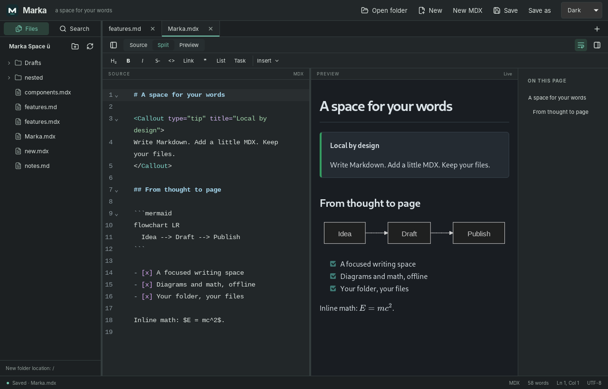

<p align="center">
  
</p>
<h1 align="center">Marka</h1>
<p align="center"><strong>A space for your words.</strong><br>A local-first desktop Markdown and safe MDX editor.</p>
<p align="center">
  <a href="https://github.com/KNN-07/Marka/releases">Releases</a> ·
  <a href="https://github.com/KNN-07/Marka/actions/workflows/build.yml">Builds</a> ·
  <a href="https://github.com/KNN-07/Marka/issues">Report an issue</a>
</p>



*Actual Linux desktop screenshot from the packaged app.*

## Write locally, preview clearly

- **Folder workspaces:** browse `.md`, `.markdown`, and `.mdx` files, create documents and folders, and search saved files across a workspace.
- **A capable source editor:** CodeMirror editing, independent tab undo histories, find/replace, formatting shortcuts and snippets, wrapping, and heading navigation.
- **Live preview:** source, split, and preview layouts; GFM tables and tasks, footnotes, syntax-highlighted code, local raster images, KaTeX math, and Mermaid diagrams.
- **Deliberately safe MDX:** bundled declarative components and literal values—not document JavaScript or project imports.
- **Save with context:** autosave for named documents, manual Save/Save As, revision-checked writes, external-change handling, and dirty-buffer close protection.
- **Make it yours:** system/light/dark themes, resizable panes, and restored workspace tabs and preferences.

Built with Tauri 2, React, TypeScript, CodeMirror 6, and Rust. Editing and bundled rendering work offline; your documents remain ordinary files in your chosen folder.

## Downloads and installation

Use [GitHub Releases](https://github.com/KNN-07/Marka/releases) for published versions. **No initial release has been published yet.** Before a release is available, download packages from a successful [Build workflow run](https://github.com/KNN-07/Marka/actions/workflows/build.yml) under **Artifacts** (GitHub sign-in may be required). Extract the artifact archive before installing or launching its contents.

| Platform target | Packages | Verification status |
| --- | --- | --- |
| Linux x64 | `.deb`, `.AppImage` | Locally built and exercised |
| Windows x64 | NSIS `.exe` installer | Pending CI and native runtime verification |
| macOS Intel + Apple Silicon | Universal `.app`, `.dmg` | Pending CI and native runtime verification |

- **Linux:** install the `.deb` with your package manager, or make the AppImage executable and run it. If FUSE is unavailable, the AppImage supports `--appimage-extract-and-run`. CI uses Ubuntu 22.04; compatibility with older distributions is not promised.
- **Windows:** run the NSIS installer. Packages are **unsigned**, so Windows SmartScreen may warn about an unknown publisher.
- **macOS:** open the disk image and copy Marka to Applications. Packages use **ad-hoc signing**, not Developer ID signing or Apple notarization; Gatekeeper may block or warn about them.

Only install artifacts you trust. These packages do not provide verified publisher identity; signing and notarization require maintainer-controlled credentials. A passing build does not replace native installation and runtime testing on each platform.

## Safe MDX, by design

Marka parses MDX without compiling or executing document JavaScript. Try this in a `.mdx` document:

```mdx
# Notes worth keeping

<Callout type="tip" title="Local first">
  **Write freely.** Your source stays in your workspace.
</Callout>

<Badge variant="success">Ready</Badge>

<Tabs defaultIndex={1}>
  <Tab title="Markdown">Tables, math, and Mermaid work here too.</Tab>
  <Tab title="MDX">Bundled components, with literal props only.</Tab>
</Tabs>

{3}
```

Supported components are `Callout`, `Badge`, and `Tabs` with direct `Tab` children. Props accept supported literal values; tabs use native, keyboard-operable radio controls. Ordinary `.md` files keep braces as text.

**Not a general-purpose MDX runtime:** imports/exports, executable expressions, spreads, custom components, event handlers, and document-provided styles are rejected. Invalid MDX displays diagnostics and retains that document's last good preview when available; source remains editable and saveable.

Preview content is sanitized and rendered in a script-disabled sandbox. Remote images and workspace SVGs are not loaded; supported local raster images must stay within the selected workspace. Links do not navigate outside the preview. Mermaid is rendered by the bundled library, with configuration overrides rejected; it is not a route to execute document code. YAML frontmatter is preserved in source but does not become executable data or preview variables. Documents are limited to 5 MiB.

## Develop

### Prerequisites

- Node.js **24** and npm.
- Stable Rust and Cargo.
- Your platform's [Tauri prerequisites](https://v2.tauri.app/start/prerequisites/): WebKitGTK and native build dependencies on Linux, MSVC tools and WebView2 on Windows, or Xcode command-line tools on macOS.

Clone [KNN-07/Marka](https://github.com/KNN-07/Marka), then run from the repository root:

```sh
npm ci
npm run tauri -- dev
```

For browser-only source editing and preview:

```sh
npm run dev
```

Open `http://localhost:1420`. Browser mode supports untitled editing, preview, and theme interactions, but **native folder access and saving require the desktop app**. It does not emulate a filesystem workspace.

### Checks and packages

```sh
# Type-check and build the frontend
npm run build

# Frontend and native regression tests
npm test
cargo test --manifest-path src-tauri/Cargo.toml

# Compile the native app without creating installers
npm run tauri -- build --no-bundle
```

Build installers on their native operating systems:

```sh
# Linux
npm run tauri -- build --bundles deb,appimage

# Windows
npm run tauri -- build --bundles nsis

# macOS (both architectures)
rustup target add aarch64-apple-darwin x86_64-apple-darwin
npm run tauri -- build --target universal-apple-darwin --bundles app,dmg
```

The `predev` and `prebuild` scripts prepare bundled KaTeX CSS/fonts automatically. No external font CDN is needed for math preview.

## CI and releases

[Build](https://github.com/KNN-07/Marka/actions/workflows/build.yml) runs checks and native package builds for pull requests, pushes, and manual dispatches. Linux, Windows, and macOS jobs upload workflow artifacts; ordinary builds do **not** publish releases.

[Release](https://github.com/KNN-07/Marka/actions/workflows/release.yml) runs on pushed `v*` tags and publishes a GitHub Release **only after all platform builds succeed**. Before tagging, keep the application versions in `package.json`, `src-tauri/Cargo.toml`, and `src-tauri/tauri.conf.json` identical, update the corresponding lockfiles, and make the tag match that version—for example, `v0.1.0` for `0.1.0`.

Release automation does not add trusted signing: Windows remains unsigned and macOS remains ad-hoc signed until publisher credentials and notarization are configured.
